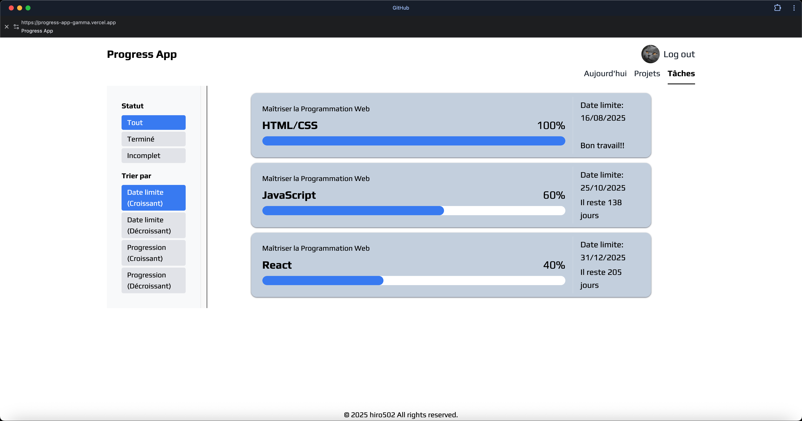
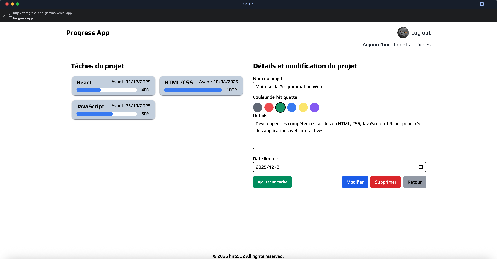

# Progress App

**Version 1.0**

## Présentation du projet

Progress App est une application simple de gestion de suivi d'apprentissage, développée avec React, Next.js et Firebase.  
Elle permet aux utilisateurs de suivre facilement leurs progrès d’apprentissage au quotidien.

Cette application est optimisée pour une utilisation sur des écrans d'une largeur minimale de 768 pixels (tablettes et plus), avec une optimisation mobile prévue prochainement.

---

## Aperçu de l'application

### 📁 Exemple 1 : Toutes les tâches



### 📊 Exemple 2 : Details du projet



---

## Fonctionnalités principales

- 🔐 **Authentification Firebase**  
  Connexion via un compte Google ou en tant qu’utilisateur invité.

- 📁 **Gestion de projets**  
  Possibilité de créer de nouveaux projets, chacun pouvant contenir plusieurs tâches.

- 🏷️ **Étiquetage par couleur**  
  Chaque projet peut être étiqueté avec une couleur pour une meilleure organisation visuelle.

- 📊 **Suivi de progression visuel**  
  Les niveaux d’avancement des projets et des tâches sont représentés par des barres de progression claires.

- 📅 **Tri intelligent**  
  Tri des projets et des tâches par date limite ou par taux de progression.

- 📆 **Affichage des tâches du jour**  
  Les tâches assignées à un jour spécifique de la semaine sont automatiquement affichées dans la section "À faire aujourd’hui".

## Utilisation

1. **Connexion**  
   Depuis la page d’accueil, sélectionnez soit la connexion avec Google, soit la connexion en tant qu’invité.

2. **Création d’un projet**  
   Sur la page “Projet”, cliquez sur **Créer un projet** dans la colonne de gauche pour ajouter un nouveau projet.

3. **Ajout de tâches**  
   Cliquez sur une carte de projet pour accéder à l’écran d’édition du projet.  
   Ensuite, cliquez sur **Ajouter une tâche** pour en créer une nouvelle avec ses détails (nom, date limite, jours de la semaine, etc.).

4. **Mise à jour du progrès quotidien**  
   Dans la page “Tâches d’aujourd’hui”, vous pouvez entrer votre avancement du jour selon le pourcentage prédéfini ou un pourcentage de votre choix.

## Technologies utilisées

### Frontend

- React
- Next.js
- Tailwind CSS
- Perline (composant UI pour l’en-tête)
- Flowbite (composant UI pour les modales)

### Backend

- Firebase (authentification et base de données)

## Installation

```bash

npm install
npx flowbite-react@latest init
npm run dev
```

## Déploiement

L'application est déployée sur Vercel :  
🔗 [https://progress-app-gamma.vercel.app/](https://progress-app-gamma.vercel.app/)

## Historique des versions

- **v1.0** - Version initiale
